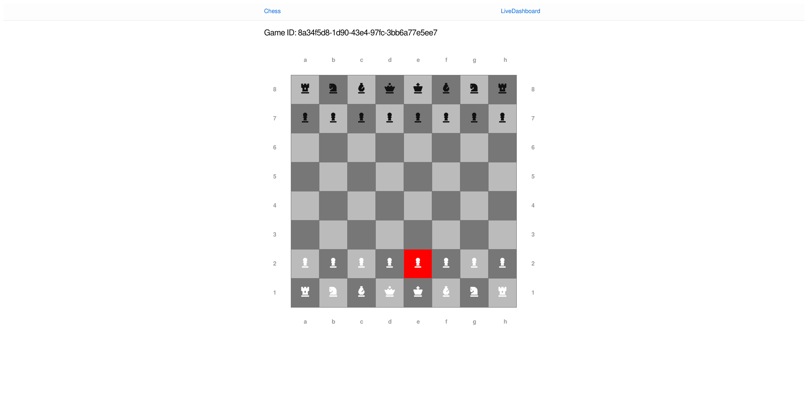

# chess
A simple chess game implemented in Elixir and Phoenix

## Screenshots

## Development Environment

To set up a local PostgreSQL database for development, you can use podman: `podman run -d -p 5432:5432 -e POSTGRES_PASSWORD=chess docker.io/library/postgres:13.2`
